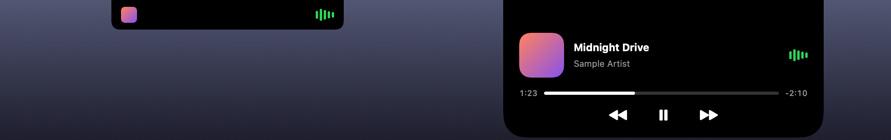

# DynamicIsland

A Dynamic Island–style music player that lives in the MacBook notch.




## Features

- Shows what's playing in **any app**: Spotify, Apple Music, YouTube and other sites in any browser.
- Compact view around the notch: album art on the left, live audio visualizer on the right.
- Hover to expand: title, artist, progress bar (click or drag to seek), previous / play-pause / next.
- Visualizer bars react to the real audio coming out of your Mac (5 frequency bands).
- Lock animation in the notch when you unlock your Mac.
- Opens at login (toggle from the right-click menu).

## Install

1. Download `DynamicIsland.dmg` from [Releases](https://github.com/podvers-cell/DynamicIsland/releases).
2. Open it and drag **DynamicIsland** into **Applications**.
3. First launch: macOS blocks apps from unidentified developers. Open
   **System Settings → Privacy & Security** and click **Open Anyway**.
   If macOS says the app is "damaged", run once:
   ```
   xattr -cr /Applications/DynamicIsland.app
   ```
4. Allow **System Audio Recording** when asked, so the visualizer can move with the music.

Right-click the island for **Open at Login** and **Quit**.

Requires macOS 14.2 or later. Works best on MacBooks with a notch.

## Build from source

Needs Xcode command line tools.

```
./build.sh        # builds DynamicIsland.app
./build.sh dmg    # also builds DynamicIsland.dmg
swift make-icon.swift   # regenerate AppIcon.icns after editing the icon
```

## How it works

- Now playing info and media controls: [mediaremote-adapter](https://github.com/ungive/mediaremote-adapter)
  (vendored in `vendor/`, BSD 3-Clause), which keeps working on macOS 15.4+.
- Visualizer: a Core Audio process tap on system output, FFT with Accelerate.
- UI: a borderless SwiftUI panel positioned over the notch. Everything is in `main.swift`.

## License

MIT, see [LICENSE](LICENSE). `vendor/mediaremote-adapter` keeps its own BSD 3-Clause license.
